Greetings 👋 I'm Magnus
=================================

Welcome to my private GitHub account!

I've been learing coding since around 2010, through work, my own projects, and some courses.
I mostly use Python, but I'm also looking into learing one or two compiled languages. To that end, I'm exploring Rust and Go (though I'm aware the former is supposedly difficult, so we'll see 😇).

* 🌍 I'm based in Oslo, Norway ⛰️🇳🇴
* 🧠 I'm learning Rust and Go, but I'm a _complete beginner_ at this stage 👶🍼
* ⚡ I once hand-fed a giraffe, a wild one, that could roam freely 🫴🦒

> [!NOTE]  
> Everything committed to repos on my private GitHub account is developed _**in my own time**_. Everything I do at work is committed to repos belonging to that organization's account, some of which are public, but most of which are private.

### 🚀 Projects:
- [Streamlit app](https://github.com/magnushelliesen/handwritten-digit-recognizer-app) that uses a pre-trained instance of a home written neural network to recognize handwritten digits on the fly. The app is hosted on Google Cloud Run, and new releases are rolled out using GitHub Actions (GitHub Actions also run Mypy and Black on PR into main)
- [Neural network](https://github.com/magnushelliesen/neural-network) written from first principles, using linear algebra-functionality from Numpy (GitHub Actions run unit tests, Mypy and Black on PR into main)
- [N-body simulator](https://github.com/magnushelliesen/n-body-simulator) that allows for simulating Newtonian gravity, at least approximately
- [Monte Carlo-simulator](https://github.com/magnushelliesen/monte-carlo-simulator) that allows for joint simulation of time series that co-vary

### 🌐 Socials:
 

### 💻 Tech Stack:

	<code></code>
	<code></code>
	<code></code>
	<code></code>
	<code></code>
	<code></code>
	<!-- <code></code> -->
	<code></code>
	<code></code>
	<code></code>
	<code></code>
	<code></code>
	<code></code>
	<code></code>
	<code></code>
	<code></code>
 	<code></code>
	<code></code>
	<code></code>
	<code></code>
	<code></code>
	<code></code>
	<code></code>
	<code></code>
	<code></code>
	<code></code>
	<code></code>
	<code></code>
	<code></code>
	<code></code>
	<code></code>
	<!-- <code></code> -->
	<code></code>
	<code></code>
	<code></code>
	<code></code>
	<code></code>
	<code></code>

### 📊 GitHub Stats:

  
  

> [!NOTE]
> 1. Stats cover only _my own_ repos. Stuff commited at work isn't counted
> 2. _Most Used Languages_ stats exclude `.ipynb` files, because they contain text, results and metadata, in addition to actual code, skewing the stats completely
